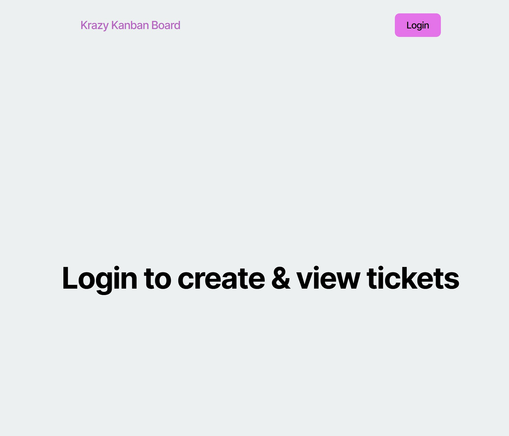
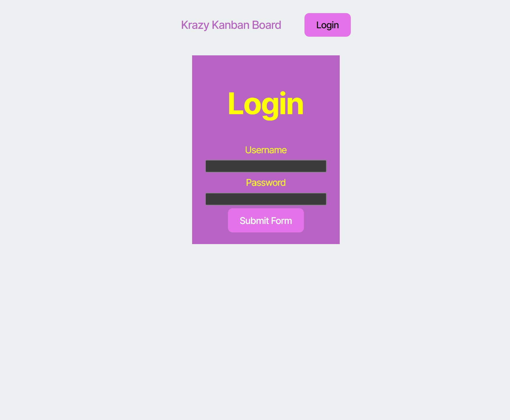
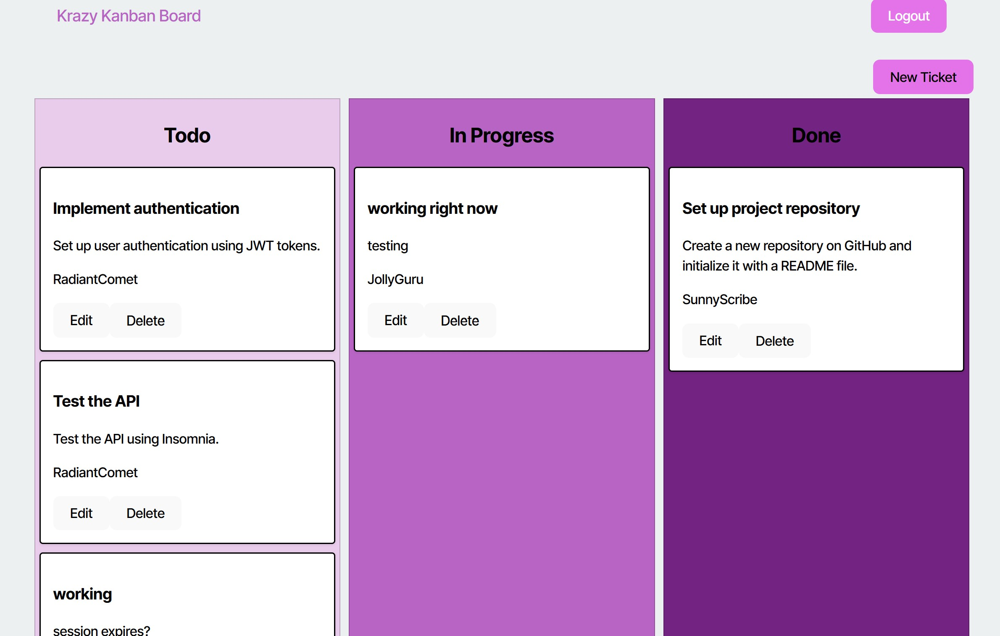

# Kanban Board

## Table of Contents
- [Description](#description)
- [Screenshots](#screenshots)
- [Installation](#installation)
- [License](#license)
- [Contributing](#contributing)
- [Tests](#tests)
- [Credit](#credit)
- [Project Links](#project-links)
- [Questions](#questions)

## Description
Securely access and manage your work tasks.

## Screenshots
Here are some previews of the Kanban Board:

### Home Page

### Login Page

### Kanban Board

## Installation
1. Go to https://kanban-board-bzob.onrender.com in your browser.

## License
This application is covered under the MIT license.

## Contributing
If you would like to contribute to my project please follow these steps!

1. Fork the repository on GitHub.
2. Clone your fork to your computer.
3. Create a new branch for your changes.
4. Make your changes and commit them using descriptive messages.
5. Push your branch and open a pull request!

## Tests
1. Ensure the webpage deploys correctly.
2. Ensure the Navbar renders correctly.
3. Ensure the login works after hitting "Sumbit Form".
4. Ensure "Edit", "Delete" and "New Ticket" buttons work.
5. Ensure all updates made are added/deleted to the board.
6. Ensure the "Logout" button works.
7. Ensure you are redirected to the login page after being idle for a period of time.
8. Ensure you cannot see the Kanban board without logging in.

## Credit

-I worked with Stacey Moenter and Alyssa Daily (classmates) on this project. 
-Diem Ly (TA) helped correct code for login error to show up on login screen. Corrected code after idle time, you are returned to login page. Also, updated css for login button to show up instead of being black. 
-Justin Moore (Tutor) helped deploy Render site correctly. 

## Project Links
Repository: https://github.com/taijamartinez/kanban-board
Deployed Render Website: https://kanban-board-bzob.onrender.com
## Questions
Reach me here with additional questions:

GitHub: https://github.com/taijamartinez

Email: taijasmartinez@gmail.com